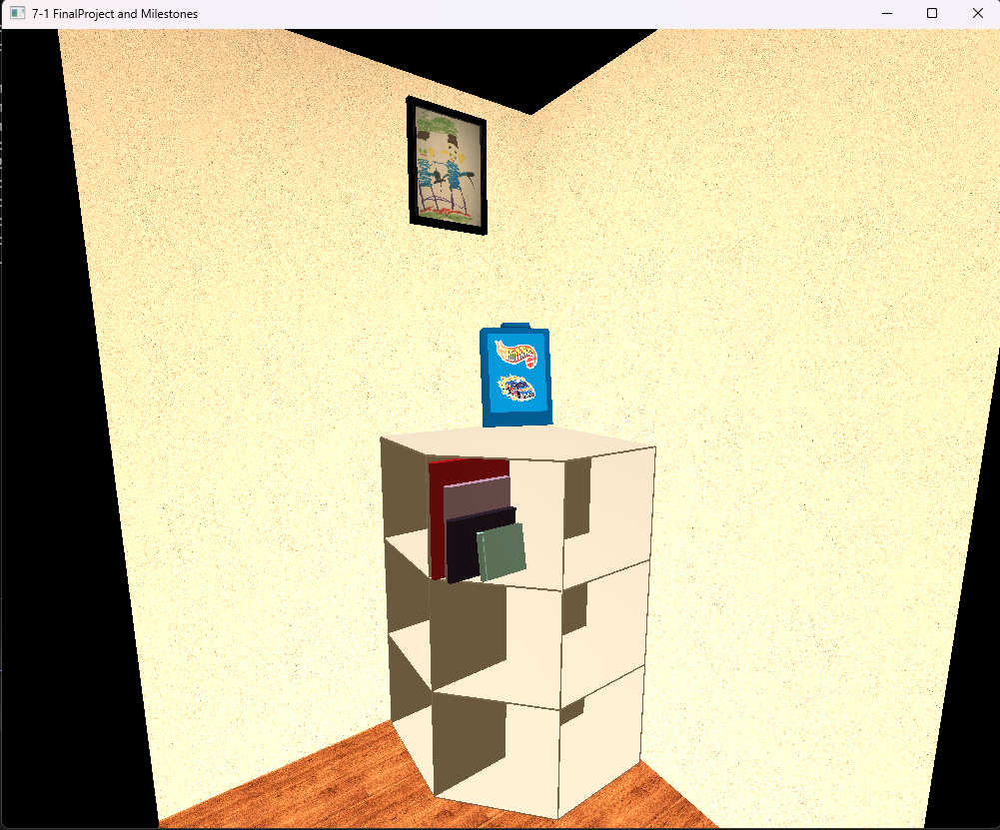

# CS-330

## How do I approach designing software?
### What new design skills has your work on the project helped you to craft?
This project helped me reinforce modular design skills by separating scene elements such as shapes, textures, lighting, and camera behavior into manageable components that additional functionality could be added to independently. 
### What design process did you follow for your project work?
For this project I followed an iterative design process that began with planning the overall layout then creating the objects with basic shapes. After the shapes were created I added textures and then lighting. 
### How could tactics from your design approach be applied in future work?
I believe that setting larger goals and then working to iteratively improve and add new functionality to work towards the final solution is a transferable process. 
## How do I approach developing programs?
### What new development strategies did you use while working on your 3D scene?
This was my first time making a graphical scene and required a different type of testing than my prior work. I had to use constant visual tests to ensure that the application was working as expected. 
### How did iteration factor into your development?
Iteration played a massive role in the development of this project. Throughout the course I slowly added the required functionality to the overall application. 
###	How has your approach to developing code evolved throughout the milestones, which led you to the project’s completion?
Throughout the process I found that as the project became more complex I introduced more frequent testing to more quickly isolate issues. 
## How can computer science help me in reaching my goals?
### How do computational graphics and visualizations give you new knowledge and skills that can be applied in your future educational pathway?
This course has given me my first academic introduction to linear algebra. I believe the introduction to more advance mathematical equations will serve me well in the rest of my academic pursuits. 
### How do computational graphics and visualizations give you new knowledge and skills that can be applied in your future professional pathway?
This project defiantly forced me to work on my problem-solving and debugging skills which are both extremely important for software engineering roles even outside of graphics focused work. 
